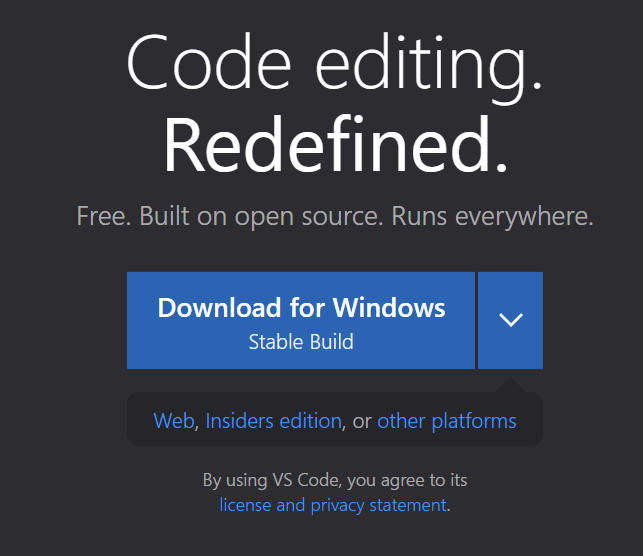

# Logging into a Course-Specific Account

---

Logging into the course-specific account is really important because it allows students to log into the school and start running commands within it for their classes. We will be learning how to log into the course-specific account on ieng6. 

## Step 1 - VSCode

We need to first find a place where we can use the terminal and log into both your own computer and the school. To do this, we will be using a software called Visual Studio Code, also known as VSCode. To install this, go to this [website](https://code.visualstudio.com/). 

You should see this: 

Select the "Download for Windows" and install the program. Once you finishing installing the program, you should see this pop up:

## Step 2 - Using Bash

Once you have downloaded Git Bash, you need to open the terminal on VSCode. To do this, use the following command: Ctrl + `. If you do that, you should see this: 

Once we pulled up the terminal, we need to do the following steps to change the normal VSCode scripting to bash scripting:

1. Use the command Ctrl + Shift + P.  This should create a drop down menu. 

2. In that search bar type in 'Select Default Profile' and click it. 
3. Select 'Git Bash' 

4. Now down in the terminal there is a plus button. Press that. 

5. Great! We have our Bash terminal ready. You can also switch between the different terminals and create more terminals if you want. 

## Step 3 - Logging In

Awesome sauce! We have finished the setup process for logging into the account. Now all we need to do is log into the account. 

We are going to first type in this to get logged in: '$ ssh cs15lwi23***@ieng6.ucsd.edu'. Make sure you change the *** to whatever letters are in your username. 

If this is your first time, you will recieve an error which is perfectly okay! Just type in 'yes' and let it run. 

Now go ahead and type in your password. 

Once you properly log in, you should see something like this: 

If this is what you see, then congratulations! You successfully logged into your account! Now you can go ahead and run whatever command you want like 'cd' or 'ls -a' or whatever else you would like to do. 

Hooray!

## Step 4 - Testing

Now we can start using commands. There are way too many commands, so I can't type them all down. However, here are some examples of some commands: 

