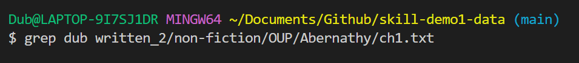
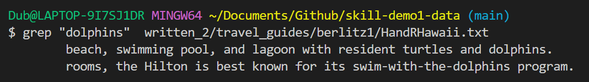
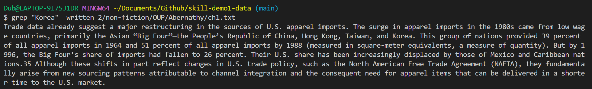
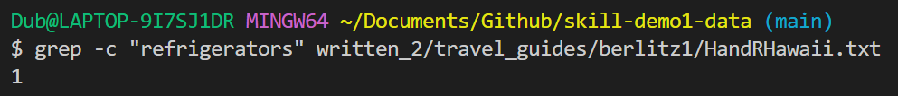
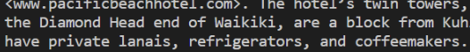
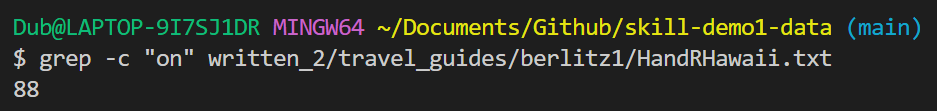
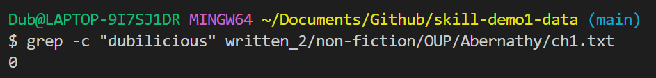
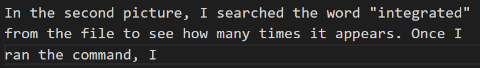
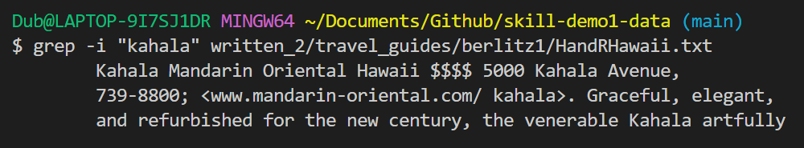
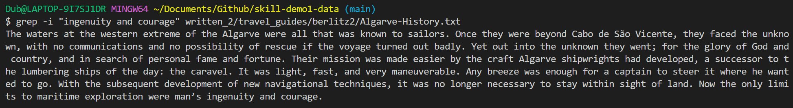

# Lab Report 9

This lab report will be a continuation of Lab Report 5. In that lab report, I decided to learn the features of the command `less`, so this time I decided to learn abou the command `grep`. The main use for `grep` is to search text and Strings in a given file. 

## 1. Finding Words in Files

The first way we can use the grep command is to find specific words in a file. 

### First Example

In this first example, we use the grep command to search for the word "Kahala" in the file `HandRHawaii.txt`. 

This picture shows the part where you run the command using `grep` to try and find the word "Kahala". The second part the result of the command. As we can see, the output is the lines that have the word "Kahala". This is useful for us because it allows us to quickly search for a specific word, almost like the `ctrl+f` function on Chrome. 

Citation: https://www.cyberciti.biz/faq/howto-use-grep-command-in-linux-unix/

### Second Example

In the first picture, I used a word that didn't appear in the text. When I typed in the command and pressed the `enter` key, it output nothing. This was the expected outcome. 

In the second picture, I used the word "Transform" and used the grep function. What output was the whole section that had the word "Transformation" within it. This is pretty useful because it shows the whole section which has a specific word.  

Citation: https://www.cyberciti.biz/faq/howto-use-grep-command-in-linux-unix/

## 2. Searching for a specific word

Rather than finding the section that contains the word, we can search for a single word itself.  

### First Example

In the first picture, I used the grep command except I used `grep "word" /filepath` rather than `grep word /filepath`. The difference is that I included quotes around the word to tell the computer that I want to search just for the word. In turn, the computer output the single line where the word appears in the file. This
command works really well because it allows us to easily find exactly where the word we are looking for is. 

Citation: https://www.cyberciti.biz/faq/howto-use-grep-command-in-linux-unix/

### Second Example

In this picture, we can see that the command was run to find the word "Korea". When we press `enter` to see the output, we can see that the lines that contain the word "Korea" is outputed. This is important because it shows us the section where the word is found very easily. 

Citation: https://www.cyberciti.biz/faq/howto-use-grep-command-in-linux-unix/

## 3. Finding the Number of Times

We can also find how many times the specific word appears in the file. 

### First Example

For this I include the `-c` along with the rest of the normal command to tell the computer that I want to count how many times the word appears. 

In the first image, I search for the word "refrigerators" and the output was 1. If we look in the actual file, or Image 2, we can see that it shows refrigerator only once. 

In the second image, I search for the word "on" which is a pretty common word, so I would be assuming that it would give me a high count. When I ran the command, it gave me 88 counts which seems right. 

This is important because it allows us to quickly find how many times a specific word is found in a file. 

Citation: https://www.geeksforgeeks.org/grep-command-in-unixlinux/

### Second Example

In the first picture, I search the word "dubilicious", which shouldn't appear in the text. Once I ran the command, it outputted 0. This shows that if there isn't a word in the text, then it will say that it counted 0 of the specific word. 

In the second picture, I searched the word "integrated" from the file to see how many times it appears. Once I ran the command, It outputted 71 which means the word "integrated" was in the file 71 times. 

This is really important because it tells us if the word is even in the text and works just like `ctrl+f` function from Google because it tells us how many times it appears. 

Citation: https://www.geeksforgeeks.org/grep-command-in-unixlinux/

## 4. Case Insensitive Searches

We can also look at specific lines from a file along with the word we are finding. 

### First Example  

In this command, I include a different thing. After the command `grep` I include a `-i` so that I can tell the computer that I am doing a case insensitive search. 

In this picture, we can see that I use the `grep -i` function to find the word "kahala". Notice how "kahala" does not have an uppercase K. When I run the command, I can see the parts where Kahala is found, even though I searched for "kahala" with a lowercase k. 

This is important because sometimes we just want to find a specific word and not worry about the case-sensitivity. 

Citation: https://www.geeksforgeeks.org/grep-command-in-unixlinux/

### Second Example 

In this image, I used the command except I decided to search up a phrase or multiple words which was "ingenuity and courage". It still worked normally, but the grep function had to search for the entire phrase. In the output, we can see that the phrase "ingenuity and courage" come at the end of the line. 

Citation: https://www.geeksforgeeks.org/grep-command-in-unixlinux/
